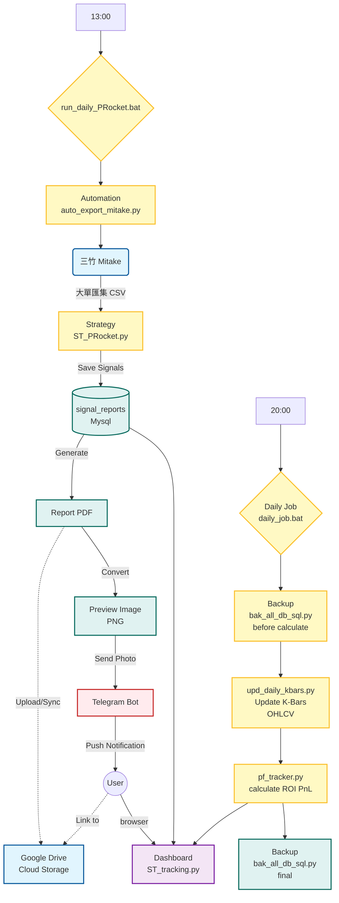
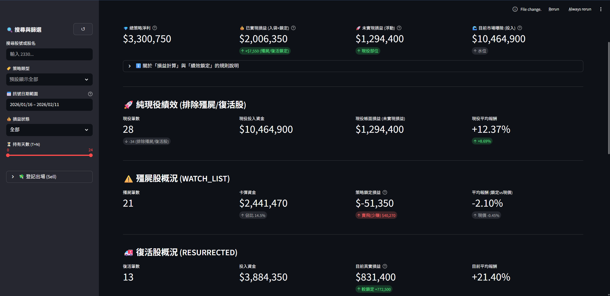
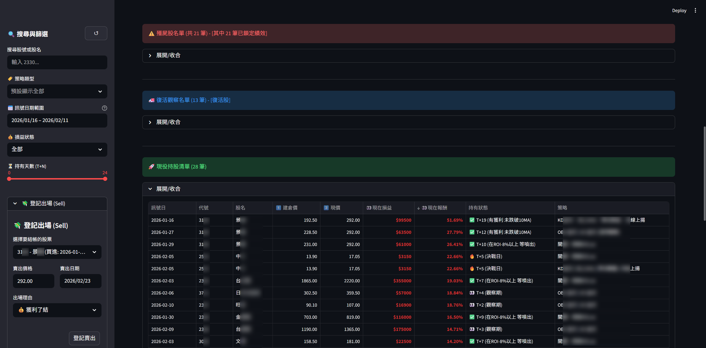

# 📈 台股波段策略分析與自動化研究平台 (Swing Trading Lab)
聲明： 本專案僅供個人研究與技術實證，不構成任何投資建議。

---

### 📝 專案概述 (Project Overview)
本專案致力於開發一套系統化的波段交易 (Swing Trading) 研究框架。相較於極短線交易，本系統更著重於趨勢辨識、風險報酬比優化以及中長期持有的邏輯實證。

系統採用模組化設計，將數據獲取、指標計算、策略執行與歷史回測解耦，建立一個可持續迭代的量化分析平台。

---

### 系統架構與模組說明 (System Architecture)

本專案由四大核心模組構成，涵蓋從資料源自動化、策略運算到視覺化監控的完整流程：

#### 1. 波段選股與績效追蹤 (Swing Trade & Dashboard) - `swingTrade/`
核心策略引擎與視覺化介面，是日常交易決策的中樞。
*   **Swing & Rocket Strategy (`ST_PRocket.py`)**: 
    *   實作多種策略邏輯。
    *   每日盤後自動掃描熱門名單，產出高潛力觀察名單。
*   **Dashboard (`ST_tracking.py`)**: 
    *   基於 Streamlit 開發的互動式畫面。
    *   即時追蹤投資組合狀態，視覺化呈現策略績效。

#### 2. 選股自動化作業 (Automation) - `automation/`
處理資料介接、每日選股與自動化任務調度。
*   **選股排程 (`run_daily_PRocket.bat`)**: 執行選股策略的自動化封裝。
    *   **資料介接 (`auto_export_mitake.py`)**: 自動化控制三竹 (Mitake) 系統匯出大單匯集名單的即時資料。
    *   **選股策略 (`ST_PRocket.py`)**: 執行多種選股策略的邏輯。

#### 3. 日常維運腳本 (Daily Scripts) - `scripts/`
負責每日盤後的標準作業程序 (SOP) 自動化。
*   **主控流程 (`daily_job.bat`)**: 串接備份(`bak_all_db_sql.py`)、日K棒資料更新(`upd_daily_kbars.py`)、帳務追蹤(`pf_tracker.py`)的一鍵式批次檔。
    *   **資料維護 (`upd_daily_kbars.py`)**: 每日更新個股日 K 線 (OHLCV) 資料庫。
    *   **帳務追蹤 (`pf_tracker.py`)**: 紀錄每日帳戶淨值、已實現/未實現損益等績效。

#### 4. 資料備份與安全 (Backups)**
確保數據與交易紀錄的安全性。
*   **資料庫備份 (`bak_all_db_sql.py`)**: 定期導出 SQL 備份檔。
*   **備份存放 (`backups/`)**: 集中管理所有歷史備份檔案。

#### 5. 通知與雲端同步 (Notification & Sync)
為了實現無人值守的監控，系統整合了 Telegram Bot 即時通知與雲端備份機制：
1.  **Telegram 策略播報**：
    *   策略執行完畢後，Bot 會自動發送當日選股摘要（KD金叉等策略篩選出的檔數）。
    *   自動將 PDF 報表首頁轉檔為圖片，直接發送至聊天室預覽，方便手機快速查閱。
    *   提供雲端硬碟連結，一鍵跳轉查看完整歷史報告。

2.  **Google Drive 雲端同步**：
    *   將 `swingTrade/out/reports` 目錄與 Google Drive 進行同步(首次需配置一次)。
    *   確保歷史選股報告與分析圖表永久保存，並可跨裝置存取。
---

### 📊 系統運作流程 (System Workflow)

以下流程圖說明了本系統如何從資料獲取到策略執行的自動化循環：



---
### 📸 系統截圖 (Screenshots)

#### 1. 策略追蹤放大鏡 (Dashboard Overview)

*即時監控波段選股名單總績效。*

#### 2. 策略名單績效

*即時監控波段選股名單個別績效。*
*左側的sidebar 可以做篩選搜尋，也手動控制停損停利*

---

### 🛠️ 當前核心策略：趨勢波段交易 (Swing Strategy - Active)
本策略專注於捕捉產業趨勢或個股波段行情，尋求具備成長潛力或型態突破的標的。

1. 選股邏輯與規則 (Selection Rules)
    趨勢過濾：利用長期均線 (MA) 與量價結構篩選出多頭排列物件。

    動能指標：結合指標（如 KD、OBV）的訊號，定位潛在起漲點。

    條件篩選：自動化過濾流動性不足或財務基本面異常之標的。

2. 風控與倉位管理 (Risk Management)
    動態停損：採用日均MA停損機制。

    風險試算：在進場前自動試算預期獲利與風險承受之比例。

---

### 技術架構 (Tech Stack)
- **語言**: Python 3.12+
- **資料庫**: MySQL (Docker Container: `mysql_fubon_db`)
- **API**: Fubon Neo API (富邦證券)
- **數據源**: 三竹大單匯集 CSV, API 即時報價


### 🚀 運行與安裝 (Installation)
1. **環境準備**:
   - 確保已安裝 Python 3.12+ 與 Docker。
   - 安裝 Python 套件:
     ```bash
     pip install -r requirements.txt
     ```
   - 啟動 MySQL 資料庫:
     ```bash
     # 手動啟動容器
     docker start mysql_fubon_db
     ```
2. **參數配置**:
   - 將 `.env.sample` 改為 `.env`
   - 在 `.env` 中填入富邦 API 帳號、密碼與憑證路徑。

### 使用說明 (Usage)
- **執行選股**
    執行 `run_daily_PRocket.bat`

- **更新績效**
    執行 `daily_job.bat`

- **啟動 Streamlit 儀表板**
    ``` Bash
    # 進入python環境
    venv/Scripts/Activate.ps1
    # 跑 streamlit
    streamlit run swingTrade/ST_tracking.py
    ```

---

作者：Billy Chen (BillyE5)


